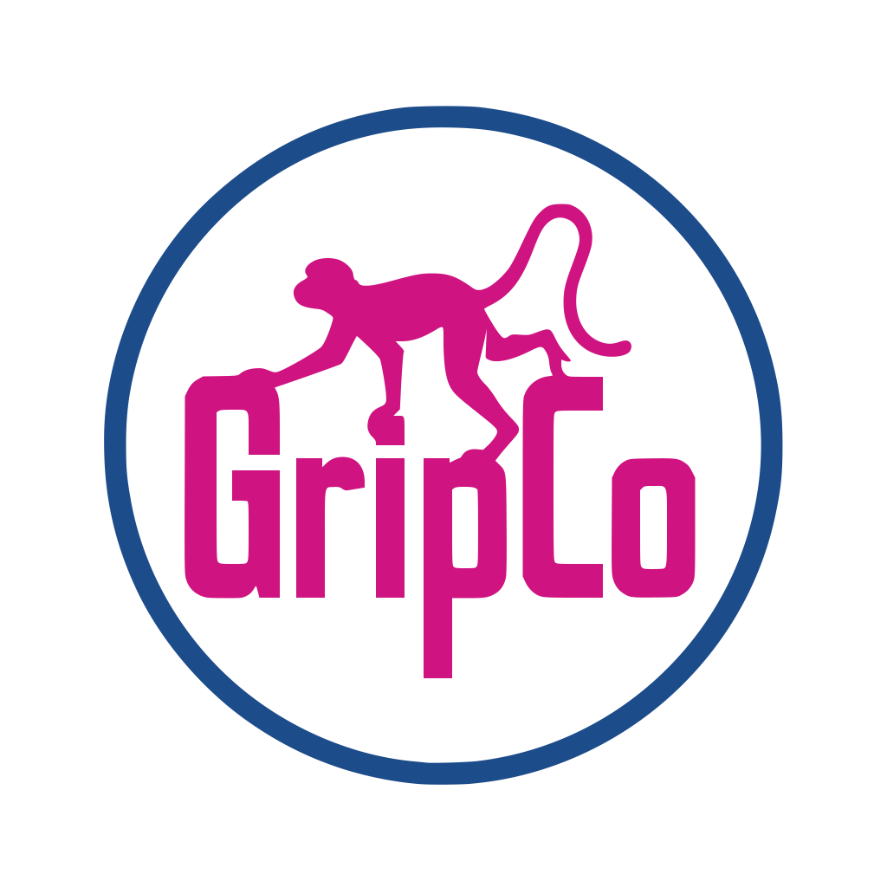
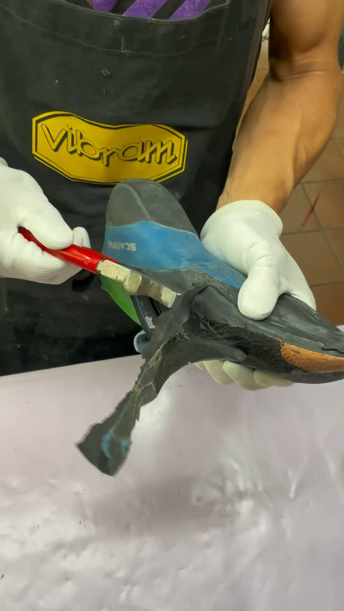
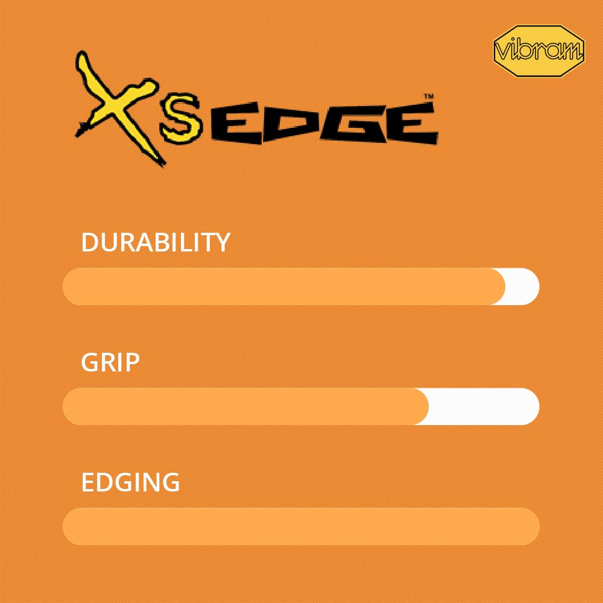
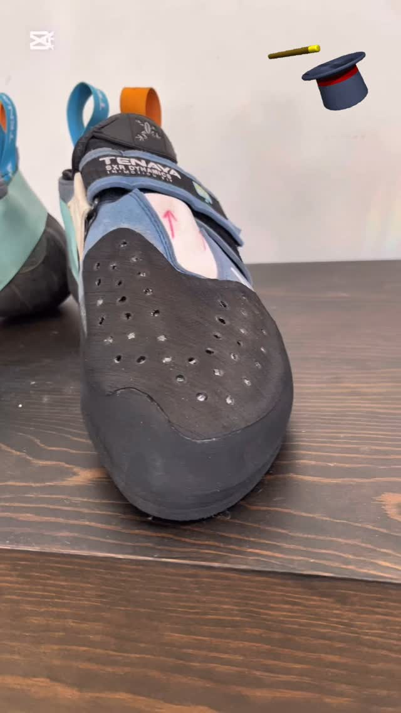
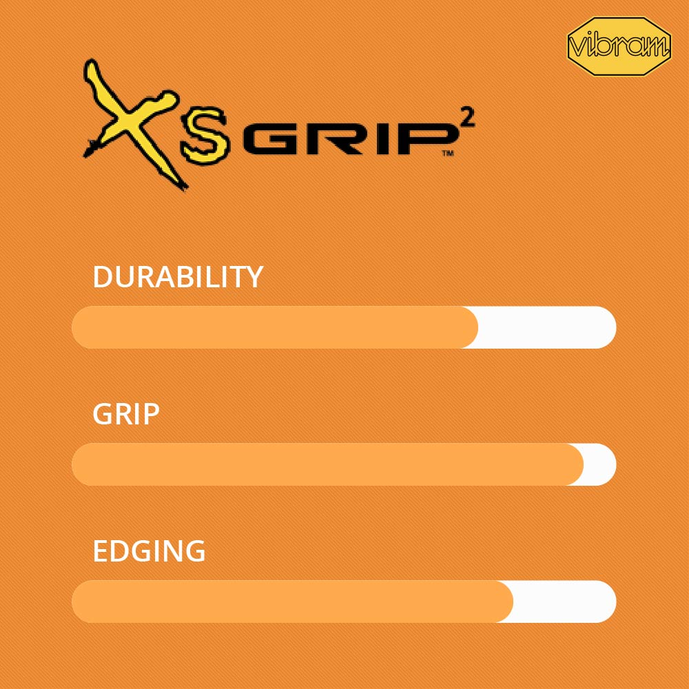

<div align="center">
  

  # Gripco
  ### Por una escalada compatible con el medio.

  [](https://angular.dev/)
  [](https://tailwindcss.com/)
  [](https://supabase.com/)
  [](https://www.typescriptlang.org/)
</div>

---

## 🧗‍♂️ Sobre Gripco (About)

**Gripco** es una plataforma orientada a promover la **sostenibilidad en la escalada** mediante el servicio de **resolado y reparación de pies de gato**. En lugar de desechar tus gatos desgastados, Gripco les da una segunda vida, utilizando gomas de alta calidad (Vibram XS-Grip, XS-Edge, etc.) para mantener un rendimiento óptimo en la roca o en el rocódromo.

<p align="center">
  
</p>

## ✨ Características (Features)

*   👟 **Servicio Personalizado:** Selección detallada del tipo de goma (`XS-Grip`, `XS-Grip 2`, `XS-Edge`, etc.) y reparaciones adicionales (Punteras / Empeine).
*   🛒 **Gestión de Cesta y Pedidos:** Los usuarios pueden agregar múltiples pares de zapatos a su carrito y tramitar un pedido completo.
*   📦 **Seguimiento Completo:** Tracking del estado del pedido desde que sale del cliente, es recibido por Gripco, pasa a estado de resolado y vuelve al escalador.
*   🌍 **Internacionalización (i18n):** Sistema de traducción personalizado integrado mediante un `TranslationService` y `TranslatePipe`.
*   🛡️ **Autenticación Segura:** Acceso de usuarios registrado y perfiles protegidos mediante [Supabase](https://supabase.com/).
*   🛠️ **Panel de Administración (Admin):** Área reservada para gestionar órdenes e inventario internamente.

## 🛠️ Tecnologías Utilizadas (Tech Stack)

### Frontend
- **Framework:** [Angular 21](https://angular.dev/) (Standalone Components, Signals, nueva API `resource`).
- **Estilos:** [Tailwind CSS v4](https://tailwindcss.com/) para diseño utilitario responsivo.
- **Componentes:** [Taiga UI](https://taiga-ui.dev/) para interfaces de usuario ricas y accesibles.
- **Iconos:** `lucide-angular`.
- **Tests:** Vitest.

### Backend y Base de Datos
- **BaaS:** [Supabase](https://supabase.com/) (Autenticación, PostgreSQL, Políticas Row Level Security).

## 🚀 Empezando (Getting Started)

Sigue estos pasos para configurar el entorno de desarrollo en tu máquina local.

### 1. Clonar el repositorio

```bash
git clone https://github.com/tu-usuario/gripco.git
cd gripco
```

### 2. Instalar dependencias

Asegúrate de tener [Node.js](https://nodejs.org/) instalado y ejecuta:

```bash
npm install
```

### 3. Configurar Variables de Entorno

Deberás conectar la aplicación con tu proyecto de Supabase. Crea un archivo `src/environments/environment.ts` (y `environment.development.ts`) añadiendo tus credenciales:

```typescript
export const environment = {
  production: false,
  supabaseUrl: 'TU_SUPABASE_URL',
  supabaseKey: 'TU_SUPABASE_ANON_KEY',
  stripePublicKey: 'TU_STRIPE_PUBLIC_KEY' // Si aplica
};
```

### 4. Servidor de Desarrollo

Ejecuta el servidor local de Angular:

```bash
ng serve
```

Abre tu navegador y ve a `http://localhost:4200/`. La aplicación se recargará automáticamente cada vez que cambies el código fuente.

## 📸 Servicios Destacados

<div align="center" style="display: flex; justify-content: center; gap: 20px;">
  <div>
    
    <p><b>Vibram XS-Edge</b></p>
  </div>
  <div>
    
    <p><b>Reparación de Puntera</b></p>
  </div>
  <div>
    
    <p><b>Vibram XS-Grip 2</b></p>
  </div>
</div>

## 🏗️ Construcción (Build)

Para compilar el proyecto y generar los artefactos para producción, ejecuta:

```bash
npm run build
```

Esto compilará el proyecto en la carpeta `dist/`. La configuración de producción, de manera predeterminada, optimizará todos los recursos.

## 🤝 Contribuyendo (Contributing)

¡Las contribuciones son bienvenidas! Si deseas mejorar Gripco, por favor sube un Pull Request o abre un *Issue* para discutir los cambios que deseas implementar. Recordamos la política de estilo: mantener componentes _standalone_, usar Signals para la reactividad y las clases de Tailwind CSS en las vistas.

---

<p align="center">
  Hecho con ❤️ para la comunidad escaladora.
</p>
